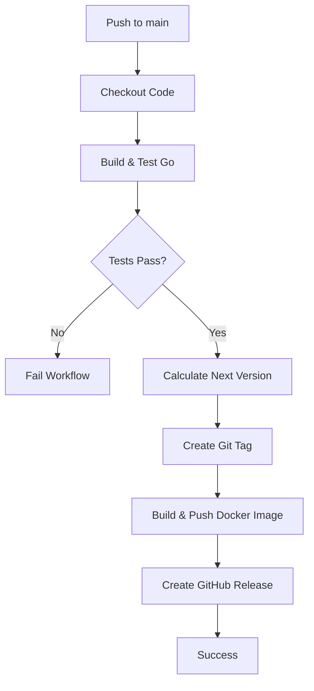
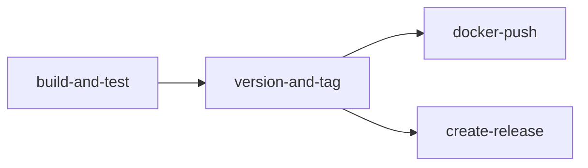

# GitHub Workflow Automated Versioning & Release Plan

## Overview
Update the existing GitHub workflow (`.github/workflows/go.yml`) to automatically version, tag Docker images, and create GitHub releases when changes are pushed to the `main` branch.

## Requirements Summary
- **Base Version**: `v0.1.x` (pre-release/beta)
- **Trigger**: Every push to `main` branch
- **Versioning**: Auto-increment patch version on each merge
- **Docker Tags**: Both semantic version (e.g., `v0.1.5`) and `latest`
- **GitHub Release**: Create release with auto-generated notes
- **Conditional Execution**: Docker push and release only after tests pass

## Current State Analysis
The existing workflow at [`.github/workflows/go.yml`](.github/workflows/go.yml:1) has:
- ✅ Build and test job for Go code
- ✅ Docker build and push to Docker Hub
- ✅ Multi-platform support (linux/amd64, linux/arm64)
- ❌ No versioning mechanism
- ❌ No GitHub release creation
- ❌ Jobs run in parallel (not conditional on test success)

## Proposed Architecture

## Recommended Approach

### Option 1: GitHub Tag Action (Recommended)
Use established GitHub Actions for versioning:

**Pros:**
- Battle-tested and maintained
- Handles edge cases (first tag, tag parsing)
- Automatic tag creation
- Support for semantic versioning conventions

**Actions to use:**
1. **`paulhatch/semantic-version@v5`** or **`anothrNick/github-tag-action@v1`**
   - Fetches latest git tag
   - Calculates next version based on base version
   - Creates new git tag

2. **`docker/metadata-action@v5`** (already in use)
   - Enhance to use calculated semantic version
   - Generate both version tag and `latest` tag

3. **`softprops/action-gh-release@v1`** or **`actions/create-release@v1`**
   - Creates GitHub release
   - Auto-generates release notes from commits

### Option 2: Custom Script Approach
Write a custom bash/Python script to manage versioning:

**Pros:**
- Full control over versioning logic
- Can customize behavior easily
- No external action dependencies

**Cons:**
- More maintenance burden
- Need to handle edge cases
- More complex to debug

### Option 3: Semantic Release
Use `semantic-release` with commit conventions:

**Pros:**
- Industry standard
- Based on conventional commits
- Can handle major/minor/patch automatically

**Cons:**
- Requires team to follow commit conventions
- More complex setup
- Overkill for simple auto-increment needs

## Recommendation
**Use Option 1** - it balances simplicity, reliability, and maintainability.

## Implementation Plan

### Workflow Structure Changes

### Jobs Breakdown

1. **`build-and-test`** (Modified from existing `build`)
   - Checkout code
   - Set up Go
   - Build
   - Run tests
   - Output: Success/Failure

2. **`version-and-tag`** (New)
   - Needs: `build-and-test` (only runs if tests pass)
   - Checkout code with full history
   - Calculate next semantic version
   - Create and push git tag
   - Output: New version string

3. **`docker-push`** (Modified from existing `push_to_registry`)
   - Needs: `version-and-tag`
   - Checkout code
   - Set up Docker buildx
   - Login to Docker Hub
   - Extract metadata with semantic version
   - Build and push with tags: `v0.1.x` and `latest`
   - Generate attestation

4. **`create-release`** (New)
   - Needs: `version-and-tag`
   - Create GitHub release
   - Use semantic version as release name
   - Auto-generate release notes

### Required Secrets
Already configured (based on existing workflow):
- `DOCKER_HUB_USERNAME`
- `DOCKER_HUB_PASSWORD`

Will use built-in:
- `GITHUB_TOKEN` (automatic, for creating releases and tags)

### Configuration Details

**Version Calculation:**
- Starting version: `v0.1.0`
- Format: `v{major}.{minor}.{patch}`
- Auto-increment: Patch version on each push
- Tag prefix: `v`

**Docker Tags:**
- `braxtone/goodbetterwurst:v0.1.0`
- `braxtone/goodbetterwurst:v0.1.1`
- `braxtone/goodbetterwurst:latest` (always points to most recent)

**GitHub Releases:**
- Title: Version number (e.g., `v0.1.5`)
- Body: Auto-generated from commits since last release
- Tag: Same as version number

## Alternative Considerations

### Should we support manual version bumps?
**Current plan**: Auto-increment patch only

**Alternative**: Allow commit message keywords to control version:
- `[major]` or `BREAKING:` → bump major version
- `[minor]` or `feat:` → bump minor version  
- Default → bump patch version

**Decision**: Start simple with patch-only auto-increment. Can add conventional commit parsing later if needed.

### Should we version on PRs?
**Current plan**: Version only on push to main

**Alternative**: Create pre-release versions for PRs (e.g., `v0.1.5-pr123`)

**Decision**: Keep it simple - version only on main branch pushes.

### Should we fail the workflow if Docker push fails?
**Current plan**: Yes, fail the entire workflow

**Alternative**: Continue and create release even if Docker push fails

**Decision**: Fail the workflow to maintain consistency between releases and Docker tags.

## Risks & Mitigations

| Risk | Impact | Mitigation |
|------|--------|------------|
| First run has no existing tags | Workflow fails | Initialize with `v0.1.0` tag manually before first run, or configure action with fallback |
| Multiple rapid pushes create version conflicts | Tag collision | Use GitHub's concurrency controls to serialize main branch deployments |
| Docker Hub rate limits | Failed pushes | Already using authenticated pushes (less likely) |
| Release notes too verbose | Cluttered releases | Can configure release action to group commits or use custom template |

## Testing Strategy

1. **Pre-deployment validation**:
   - Review workflow syntax using GitHub Actions validator
   - Verify all required secrets are set

2. **Initial deployment**:
   - Manually create initial tag `v0.1.0` before first workflow run
   - Make a small test commit to main
   - Verify version increments to `v0.1.1`
   - Check Docker Hub for both version tag and latest tag
   - Check GitHub releases for new release with notes

3. **Follow-up validation**:
   - Make another test commit
   - Verify version increments to `v0.1.2`
   - Verify Docker tags update correctly
   - Verify release notes capture commits properly

## Rollback Plan

If the new workflow causes issues:
1. Revert to current workflow (commit before changes)
2. Delete any erroneous git tags: `git push --delete origin vX.X.X`
3. Delete any erroneous releases via GitHub UI
4. Docker tags cannot be deleted but can be overwritten

## Future Enhancements

- [ ] Add conventional commit parsing for smart version bumping
- [ ] Add pre-release tags for feature branches
- [ ] Integrate changelog generation
- [ ] Add Slack/Discord notifications on releases
- [ ] Add rollback mechanism for failed deployments
- [ ] Version validation against API compatibility

## Success Criteria

✅ Successful test and build on every push to main  
✅ Automatic patch version increment on each merge  
✅ Docker image tagged with semantic version and latest  
✅ GitHub release created with version and auto-generated notes  
✅ No manual intervention required for standard deployments  
✅ Clear audit trail of versions in git tags, Docker Hub, and GitHub releases
